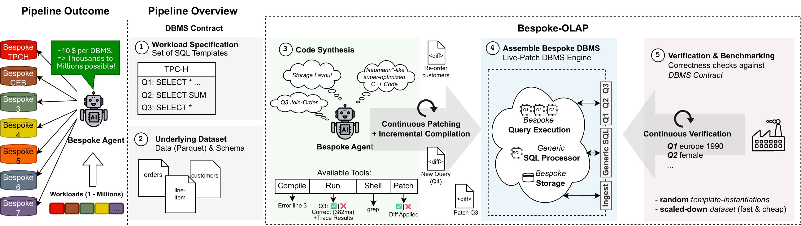
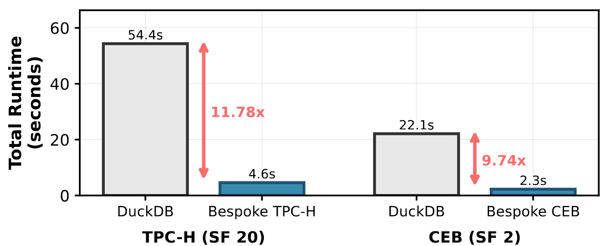

[](https://www.python.org/downloads/)
[](LICENSE)
[](https://github.com/astral-sh/uv)
[](https://github.com/astral-sh/ruff)
[]()
[](https://arxiv.org/pdf/2603.02001)
# Bespoke-OLAP

Sourcecode of the paper *Bespoke OLAP: Synthesizing Workload-Specific One-size-fits-one Database Engines*

**Quick links:** &nbsp;
[📄 Paper](https://arxiv.org/pdf/2603.02001) &nbsp;·&nbsp;
[🌐 Webpage](https://datamanagementlab.github.io/BespokeOLAP/) &nbsp;·&nbsp;
[▶ Live Runner](https://datamanagementlab.github.io/BespokeOLAP/web-runner/)

The generated C++ artifacts of *Bespoke-TPCH* and *Bespoke-CEB* are available in the [BespokeOLAP_Artifacts](https://github.com/DataManagementLab/BespokeOLAP_Artifacts) repository.

An LLM agent that automatically generates and optimizes custom C++ OLAP query engines for user specified workloads. The agent generates C++ code, compiles it, and iteratively improves performance through sophisticated optimization loops. Results are tracked in Weights & Biases (wandb).

<div align="center">
    <figure>
        
        <p><em>Bespoke OLAP: Synthesizing Workload-Specific Database Engines</em></p>
    </figure>
    <figure>
        
        <p><em>Performance improvements across workloads</em></p>
    </figure>
</div>

Statistics of the generated engines and optimization runs can be found in this public [wandb project](https://wandb.ai/jwehrstein/BespokeOLAP).

---

## 🌐 Interactive Demo

> **[datamanagementlab.github.io/BespokeOLAP](https://datamanagementlab.github.io/BespokeOLAP/)**
>
> - **Synthesis explainer** — step-by-step walkthrough of what happened in each synthesis stage
> - **Live demo** — run the synthesized DBMS with custom query placeholders directly in the browser

---

## How It Works

1. **Storage plan generation** — the agent designs a custom data layout for the target workload
2. **Base implementation** — the agent generates a complete C++ engine (loader, builder, query executors)
3. **Optimization loop** — the agent iteratively improves performance, guided by speedup metrics and automatic validation against DuckDB reference results

The generated engine uses a hot-reload architecture: loader, builder, and query executors are compiled as shared libraries and reloaded without restarting the host process.

## Prerequisites

- Linux (x86-64)
- C++ toolchain (`gcc` / `clang`)
- Python 3.10+
- [`uv`](https://github.com/astral-sh/uv) package manager
- Apache Arrow and Parquet development libraries

## Installation

### 1. Install uv

```bash
curl -LsSf https://astral.sh/uv/install.sh | sh
```

*Optional:* Setup Weights & Biases (wandb) account and API key for experiment tracking. You can sign up for free at [https://wandb.ai/](https://wandb.ai/).

### 2. Install Arrow and Parquet libraries

```bash
wget https://packages.apache.org/artifactory/arrow/$(lsb_release --id --short | tr 'A-Z' 'a-z')/apache-arrow-apt-source-latest-$(lsb_release --codename --short).deb
sudo apt install -y -V ./apache-arrow-apt-source-latest-$(lsb_release --codename --short).deb
sudo apt update
sudo apt install -y libarrow-dev libparquet-dev parquet-tools
```

### 3. Install Python dependencies

```bash
uv sync
```

### 4. Configure environment

Create a `.env` file with your API keys:

```bash
OPENAI_API_KEY=...
WANDB_ENTITY=... # Optional, e.g. "my-team"
WANDB_PROJECT=... # Optional, e.g. "bespoke-olap"
```

### 5. Prepare Parquet data

Place TPC-H or CEB Parquet files in your artifacts directory (default: `/mnt/labstore/bespoke_olap/`). The path can be overridden with `--base_parquet_dir`.

## Usage

### 1. Activate your Python environment

```bash
source .venv/bin/activate
```

### 2. Generate a storage plan for your workload
The conversation name resembles: `storageplan{q_id}-{q_id}v{version}`. For example, `storageplan1-22v1` is a storage plan generated for TPC-H queries 1 and 22, version 1.
```bash
# TPC-H
python run_gen_storage_plan.py \
    --conv storageplan1-22v1 \
    --benchmark tpch \
    --auto_u --auto_finish

# CEB
python run_gen_storage_plan.py \
    --conv storageplan1a-11bv1 \
    --benchmark ceb \
    --auto_u --auto_finish
```
(Optional) `--auto_u` and `--auto_finish` flags can be used to automatically approve prompts and finish the conversation when no more prompts remain, enabling a fully automated run. Use with caution, as it will skip all user interactions.

### 3. Generate a base implementation

```bash
# TPC-H
python run_gen_base_impl.py \
    --conv basef1-22v1 \
    --benchmark tpch \
    --auto_u --auto_finish

# CEB
python run_gen_base_impl.py \
    --conv basef1a-11bv1 \
    --benchmark ceb \
    --auto_u --auto_finish
```
Conv name represents: `basef{q_id}-{q_id}v{version}`. For example, `basef1-22v1` is a base implementation generated for TPC-H queries 1 and 22, version 1.

### 4. Run the optimization loop
To run the optimization loop, please specify the wandb run-id of the run producing the base implementation (see 3.).
The script will automatically look up the final snapshot created at the end of that conversation and load this git snapshot automatically.
I.e. any past run can be loaded as a starting point for the optimization loop, as long as the final snapshot of that run is available in the git cache. This allows you to easily continue and optimize from any past run, or even share runs across machines by sharing the git snapshot cache (see "Remote snapshot cache" below).
Store the wandb run-id in the `run_optim_loop.py` header. 

```bash
# TPC-H
python run_optim_loop.py \
    --conv runoptim1-22v1 \
    --bespoke_storage \
    --benchmark tpch \
    --auto_u --auto_finish

# CEB
python run_optim_loop.py \
    --conv runoptim1a-11bv1 \
    --bespoke_storage \
    --benchmark ceb \
    --auto_u --auto_finish
```

### Hint: Conversation Names
Conversation names are used to organize and track runs.
They first create separate log-files but also identify traces, snapshots, and metrics in wandb.
Further they reference the queries for which an engine is generated and optimized, as well as the version number for the generated engine.
Hence they have to be unique - this is also enforced by the system.
Usually naming conventions (conversation name prefixes) are enforced by the scripts.

## Optionally
### Run the agent manually (interactive)

```bash
python main.py manual \
    --conv_name <name> \
    --query_list <q_ids> \
    --benchmark tpch
```

### Benchmark a generated engine

```bash
python -m benchmark --systems bespoke,duckdb --snapshots <hash1,hash2,...> --scale_factors 1,5,20 --benchmark tpch
```

See [Benchmarking guide](benchmark/README.md) for details and additional examples.

## CLI Reference

Common arguments shared across entry points:
(We recommend using the prepared scripts above, which have the appropriate arguments pre-configured.)

| Argument                  | Default              | Description                                                                              |
|---------------------------|----------------------|------------------------------------------------------------------------------------------|
| `--benchmark`             | `tpch`               | Benchmark to use (`tpch` or `ceb`).                                                      |
| `--conv` / `--conv_name`  | *(required)*         | Conversation name (auto-prefixed with benchmark name).                                   |
| `--model`                 | `gpt-5.2-codex`      | LLM model ID to use.                                                                     |
| `--artifacts_dir`         | `/mnt/labstore/...`  | Directory for caches, logs, conversations, and Parquet data.                             |
| `--base_parquet_dir`      | *(artifacts_dir)*    | Base directory for Parquet files.                                                        |
| `--replay`                | `False`              | Replay a prior run strictly from cache (fails on cache miss).                            |
| `--replay_cache`          | `False`              | Reuse cached prompts; auto-advance until the first uncached LLM call.                   |
| `--auto_u`                | `False`              | Auto-approve all prompts without user interaction. Use with caution.                     |
| `--auto_finish`           | `False`              | Automatically finish when no more prompts remain in the conversation. Otherwise the user can continue prompting manually.                   |
| `--notify`                | `False`              | Send a notification when the conversation requires user input.                           |
| `--disable_wandb`         | `False`              | Skip wandb logging.                                                                      |
| `--disable_repo_sync`     | `False`              | Skip pushing snapshots to the remote git cache.                                          |
| `--disable_valtool`       | `False`              | Disable automatic validation after each compile+run.                                     |
| `--start_snapshot`        | `None`               | Git snapshot hash to start from.                                                         |
| `--storage_plan_snapshot` | `None`               | Git snapshot hash to load a storage plan from.                                           |
| `--continue_run`          | `False`              | Continue from the current working-dir state instead of a clean snapshot.                 |

## Architecture

### Agent Loop (`main.py`)

The core orchestrator. It drives a conversation using four tools:

- **`ApplyPatchTool`** — edits files in `./output/`
- **`ShellTool`** — runs shell commands in `./output/`
- **`compile_tool`** — compiles the C++ engine in `./output/build/`
- **`run_tool`** — compiles, runs queries, and validates results against DuckDB

### Conversation Modes (`conversations/`)

- **`ScriptedConversation`** — plays through a JSON list of pre-written prompts; the user can interject or replace prompts interactively
- **`OptimizationConversation`** — self-steering loop that reads speedup metrics and decides when to continue, revert, or stop

Accepted prompts are persisted to a JSON file in `artifacts_dir/conversations/` so runs can be replayed exactly.

### C++ Engine Template (`misc/fasttest/`)

The template and host process for the generated OLAP engine. The agent generates and modifies:

- `loader_impl.{cpp,hpp}` — loads Parquet data into `ParquetTables`
- `builder_impl.{cpp,hpp}` — transforms `ParquetTables` into a custom `Database` layout
- `query_impl.{cpp,hpp}` — executes individual queries against `Database`
- `db.cpp` — host process; detects `.so` changes and hot-reloads without restarting

### Caching System (`llm_cache/`)

Multi-layer caching for reproducibility:

- **LLM cache** — hashes requests and stores/replays responses from disk
- **Shell cache** — caches shell command outputs keyed by working-dir snapshot and command
- **Compaction cache** — caches context compaction results
- **`GitSnapshotter`** — manages a git repo inside `./output/` to snapshot and restore the working directory between agent turns. Named snapshots are stored as git refs (`refs/snapshots/*`).

To clear caches, delete the relevant subdirectories under `artifacts_dir/cache/` and `./output/.git`.

### Validation (`tools/validate_tool/`)

`QueryValidator` runs the generated engine at multiple scale factors and compares results against DuckDB. Invoked automatically by `run_tool` after each compile+run.

### Benchmarking (`benchmark/`)

Separate from the agent loop. See [benchmark/README.md](benchmark/README.md).

## Development

### Inspect running engine processes

```bash
watch -n1 -d ./misc/get_db_procs.sh
```

### Query Parquet files with DuckDB

```bash
duckdb :memory:
```

```sql
.timer on
PRAGMA threads=1;

CREATE TABLE orders   AS SELECT * FROM read_parquet('orders.parquet');
CREATE TABLE lineitem AS SELECT * FROM read_parquet('lineitem.parquet');
-- ... add other tables as needed
```

### Remote snapshot cache (optional)

To share snapshots across machines, set up a bare git repository and start a git daemon:

```bash
git init --bare bespoke_cache.git
touch bespoke_cache.git/git-daemon-export-ok

git daemon \
    --base-path=./ \
    --export-all \
    --enable=receive-pack \
    --reuseaddr \
    --verbose
```

The cache URL is `git://<hostname>/bespoke_cache.git`. Pass it via the appropriate config option, or leave it unset to use only the local snapshot cache (with `--disable_repo_sync`).
